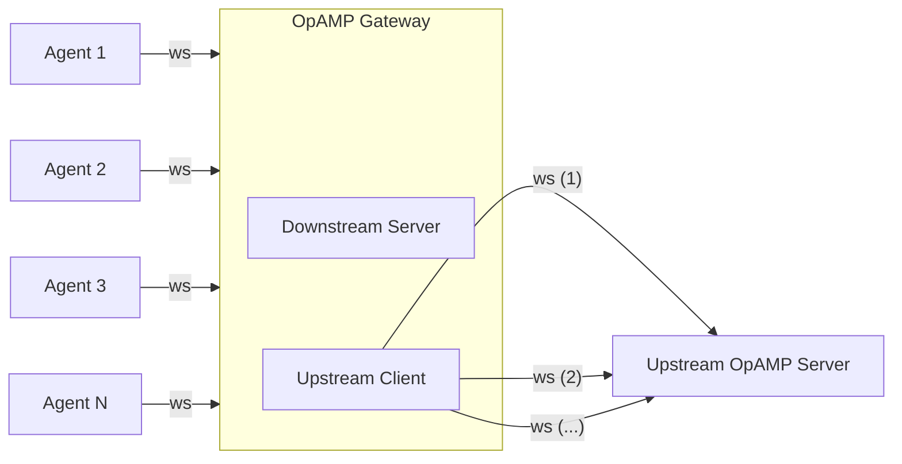

# OpAMP Gateway Extension

| Status  |           |
|---------|-----------|
| Stability | [alpha]  |
| Type    | extension |

The OpAMP Gateway is an OpenTelemetry Collector extension that relays
[OpAMP](https://opentelemetry.io/docs/specs/opamp/) messages between
downstream agents and an upstream OpAMP server. It multiplexes many agent
WebSocket connections over a configurable number of persistent upstream
connections, reducing the connection load on the OpAMP server.

The Collector running this extension is typically also configured as an
[OpenTelemetry Gateway](https://opentelemetry.io/docs/collector/deployment/gateway/)
to receive telemetry from agents and forward it to a backend. Multiple
gateways can be chained together, and gateways can be deployed behind a load
balancer for high availability.

## Motivations

1. **Network isolation** -- In deployments where agents cannot reach the OpAMP
   server directly (firewalled or air-gapped networks), the gateway acts as a
   relay that bridges the two networks.

2. **Connection fan-in** -- Rather than requiring a dedicated WebSocket per
   agent, the gateway fans thousands of agent connections into a small number
   of upstream connections, making it practical to scale to very large fleets.

## How It Works



1. The gateway opens `server.connections` persistent WebSocket connections to
   the upstream OpAMP server.
2. The gateway listens for incoming agent WebSocket connections on the
   configured `listener.endpoint`.
3. When an agent connects, the gateway authenticates it by sending an
   `OpampGatewayConnect` custom message upstream and waiting for an
   `OpampGatewayConnectResult` response. If rejected, the agent receives the
   appropriate HTTP status code.
4. Once accepted, the agent's WebSocket is upgraded. A downstream connection is
   assigned to the upstream connection with the fewest active agents
   (least-connections load balancing).
5. All `AgentToServer` messages from the agent are forwarded upstream on the
   assigned connection. All `ServerToAgent` messages addressed to the agent are
   forwarded back downstream.

## Configuration

| Field | Type | Default | Description |
|-------|------|---------|-------------|
| `server.endpoint` | string | *(required)* | WebSocket URL of the upstream OpAMP server. Must use `ws://` or `wss://` scheme. |
| `server.headers` | map | *(none)* | HTTP headers sent on upstream connections (e.g. `Authorization`). Setting `User-Agent` here overrides the default described below. |
| `server.tls` | [TLS config](https://pkg.go.dev/go.opentelemetry.io/collector/config/configtls#ClientConfig) | *(none)* | TLS configuration for the upstream client connection. |
| `server.connections` | int | `1` | Number of persistent WebSocket connections to maintain to the upstream server. |
| `listener.endpoint` | string | `"0.0.0.0:0"` | Address the downstream server listens on for agent connections. |
| `listener.tls` | [TLS config](https://pkg.go.dev/go.opentelemetry.io/collector/config/configtls#ServerConfig) | *(none)* | TLS configuration for the downstream server. |

### User agent

Upstream connections identify themselves with an [RFC 9110][rfc9110] product
list naming the gateway, the collector distribution hosting it, and the
platform:

```
opamp-gateway/v1.1.0 dynatrace-bindplane-otel-collector/v1.0.0 (linux/amd64)
```

- `opamp-gateway/<version>` is the version of the `opampgateway` extension
  module, read from the binary's build information. It is `unknown` for builds
  that replace the module with a local directory, such as
  `make build-collector`.
- `<collector>/<version>` comes from the collector's `BuildInfo`, using the base
  name of its command. It is omitted when the build information does not name
  both. `BuildInfo.Description` is not used because it is prose rather than a
  valid product token.

Set `server.headers.User-Agent` to send a different value instead.

[rfc9110]: https://www.rfc-editor.org/rfc/rfc9110#field.user-agent

### Example

```yaml
extensions:
  opampgateway:
    server:
      endpoint: wss://opamp.example.com/v1/opamp
      headers:
        Authorization: "Secret-Key ${env:OPAMP_SECRET_KEY}"
      connections: 3
    listener:
      endpoint: 0.0.0.0:4320
      tls:
        cert_file: /etc/otel/server.crt
        key_file: /etc/otel/server.key

service:
  extensions: [opampgateway]
```

### Minimal (no TLS)

```yaml
extensions:
  opampgateway:
    server:
      endpoint: ws://opamp-server:4320/v1/opamp
    listener:
      endpoint: 0.0.0.0:4320

service:
  extensions: [opampgateway]
```

## Authentication

The gateway delegates agent authentication to the upstream OpAMP server. When
an agent connects, the gateway sends the agent's HTTP headers and remote
address upstream as an `OpampGatewayConnect` custom message
(capability: `com.bindplane.opamp-gateway`, type: `connect`). The upstream
server responds with an `OpampGatewayConnectResult` (type: `connectResult`)
indicating whether to accept or reject the connection, along with an HTTP
status code and optional response headers.

If the upstream server does not respond within 30 seconds, the agent receives a
`504 Gateway Timeout`.

## Chaining Gateways

The `server.endpoint` of a gateway can point at another gateway's
`listener.endpoint` instead of the OpAMP server, so agents can connect through
any number of gateways:

```
agent -> gateway C -> gateway B -> gateway A -> OpAMP server
```

Each gateway authenticates its own agents by sending an `OpampGatewayConnect`
message upstream. That message is created by the gateway rather than by an
agent, so it has no `instance_uid`. A gateway that receives such a message from
a downstream gateway relays it unchanged toward the OpAMP server and routes the
matching `OpampGatewayConnectResult` back to the gateway that sent it, using the
`request_uid` in the message. The OpAMP server therefore makes the accept or
reject decision for every agent, no matter how many gateways are in between.

Messages that carry an `instance_uid` are routed by agent ID as usual.

## Telemetry

The extension emits the following metrics, all tagged with a `direction`
attribute (`upstream` or `downstream`):

| Metric | Type | Unit | Description |
|--------|------|------|-------------|
| `opampgateway.connections` | Sum (int) | `{connections}` | Current number of active connections. |
| `opampgateway.messages` | Sum (int, monotonic) | `{messages}` | Total messages forwarded. |
| `opampgateway.messages.bytes` | Sum (int, monotonic) | `B` | Total bytes forwarded. |
| `opampgateway.messages.latency` | Histogram (int) | `ms` | Time spent in the gateway before forwarding a message. |

## Logging

At the collector's default `info` log level the gateway is quiet in steady
state. Message traffic is never logged at `info`, and an agent connecting or
disconnecting produces no `info` lines. Use the metrics above to observe
message and connection volume. The lines to expect at `info` and above are:

| Event | Level |
|-------|-------|
| Server listening for agent connections | `info` |
| Connecting to, and connected to, the upstream OpAMP server | `info` |
| Upstream connection lost, with the error that ended it. Logged once per loss, not per retry. | `warn` |
| Upstream connection attempt failed. Logged for the first attempt only; retries are logged at `debug` with the backoff interval. | `warn` |
| No upstream connection available for a connecting agent. Logged at most once a minute with a count of the suppressed occurrences. | `warn` |
| Agent rejected by the upstream OpAMP server, or its authentication timed out | `warn` |
| Client stopped and each upstream connection shut down | `info` |
| Errors other than ordinary disconnects | `error` |

Ordinary disconnects, such as a WebSocket close frame, a closed socket, an EOF
or a cancelled context, are expected whenever an agent or the upstream server
goes away and are logged at `debug` rather than `error`.

To troubleshoot a connection, raise the collector log level:

```yaml
service:
  telemetry:
    logs:
      level: debug
```

At `debug` the gateway additionally logs each connection request and its
authentication result, the assignment of agents to upstream connections, every
message forwarded in each direction with its size and the components it
carries, the close of each connection, and each reconnect attempt with its
backoff interval.